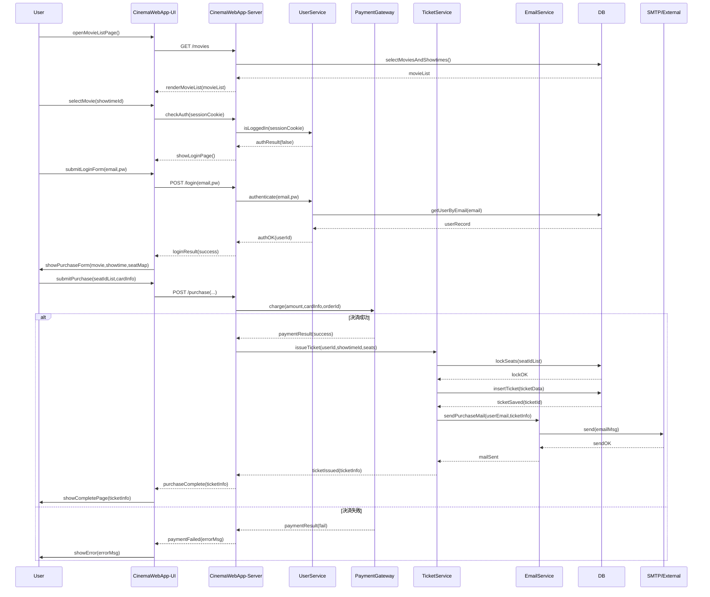

# 演習：映画チケット購入フローのシーケンス図作成

## ① 参加オブジェクト（ライフライン）の洗い出し

Actor（利用者・外部システム）
・User … 映画を選び、チケット購入を行う実在の顧客
・PaymentGateway … クレジットカード決済を実行する外部決済プロバイダ

Boundary（UI や API エンドポイントなど、Actor とシステムの境界面）
・CinemaWebApp‐UI … ブラウザで動く画面一式（映画一覧、ログイン画面、購入ページ、完了ページ）
・LoginForm … メール／パスワード入力を受け取る UI 部品
・PurchasePage … 上映日時・座席・支払い情報を入力させる UI 部品

Control（ワークフローやビジネスロジックを調整する調停役）
・CinemaWebApp‐Server … UI からのリクエストを受け取り、各 Service を呼び出す調整役
・UserService … 認証とユーザー情報取得を担当
・TicketService … 座席在庫確認・チケット発行・DB 永続化を統括
・EmailService … メール送信キュー投入や SMTP 呼び出しを行う

Entity（永続化される業務データ、ドメインモデル）
・UserAccount … email, hashedPassword, etc.
・Movie … タイトル・上映時間など
・Showtime … 上映日時／スクリーン／座席構成
・Seat … 座席番号・状態（空席／確保／販売済み）
・Ticket … 予約番号、QR コード、User 参照、Showtime 参照、Seat 参照
・PaymentTransaction … 金額、ステータス、決済 ID
・EmailMessage … 宛先、件名、本文、送信状態

DataStore（補助的に言及しておくと分かりやすいオブジェクト）
・DB … 各 Entity を保存するリレーショナル／NoSQL DB

## ② シーケンス図に含めるメッセージ一覧の作成

────────────────────────────────
A. 映画一覧～作品選択
────────────────────────────────
User → CinemaWebApp-UI : openMovieListPage()
CinemaWebApp-UI → CinemaWebApp-Server : GET /movies
CinemaWebApp-Server → DB : selectMoviesAndShowtimes()
DB → CinemaWebApp-Server : movieList
CinemaWebApp-Server → CinemaWebApp-UI : renderMovieList(movieList)
（画面上でユーザーが作品と上映日時をクリック）6. User → CinemaWebApp-UI : selectMovie(showtimeId)
────────────────────────────────
B. ログイン判定 & 認証（未ログイン時のみ）
────────────────────────────────
7. CinemaWebApp-UI → CinemaWebApp-Server : checkAuth(sessionCookie)
8. CinemaWebApp-Server → UserService : isLoggedIn(sessionCookie)
9. UserService → CinemaWebApp-Server : authResult(false) ←未ログイン
＜alt 未ログイン＞
10. CinemaWebApp-Server → CinemaWebApp-UI : showLoginPage()
11. User → CinemaWebApp-UI : submitLoginForm(email,pw)
12. CinemaWebApp-UI → CinemaWebApp-Server : POST /login(email,pw)
13. CinemaWebApp-Server → UserService : authenticate(email,pw)
14. UserService → DB : getUserByEmail(email)
15. DB → UserService : userRecord
16. UserService → CinemaWebApp-Server : authOK(userId | fail)
17. CinemaWebApp-Server → CinemaWebApp-UI : loginResult(success)＜end alt＞
────────────────────────────────
C. 購入入力～決済リクエスト
────────────────────────────────
18. CinemaWebApp-UI → User : showPurchaseForm(movie,showtime,seatMap)
19. User → CinemaWebApp-UI : submitPurchase(seatIdList, cardInfo)
20. CinemaWebApp-UI → CinemaWebApp-Server : POST /purchase(userId,showtimeId,seatIdList,amount,cardInfo)
────────────────────────────────
D. 決済処理
────────────────────────────────
21. CinemaWebApp-Server → PaymentGateway : charge(amount,cardInfo,orderId)
22. PaymentGateway → CinemaWebApp-Server : paymentResult(success|fail)
＜alt 決済成功＞
────────────────────
E. チケット発行 & メール送信
────────────────────
23. CinemaWebApp-Server → TicketService : issueTicket(userId,showtimeId,seatIdList)
24. TicketService → DB : lockSeats(seatIdList)
25. DB → TicketService : lockOK
26. TicketService → DB : insertTicket(ticketData)
27. DB → TicketService : ticketSaved(ticketId)
28. TicketService → EmailService : sendPurchaseMail(userEmail,ticketInfo)
29. EmailService → SMTP/External : send(emailMsg)
30. SMTP/External → EmailService : sendOK
31. EmailService → TicketService : mailSent
32. TicketService → CinemaWebApp-Server : ticketIssued(ticketInfo)
33. CinemaWebApp-Server → CinemaWebApp-UI : purchaseComplete(ticketInfo)
34. CinemaWebApp-UI → User : showCompletePage(ticketInfo)
＜end alt＞

＜alt 決済失敗＞
35. CinemaWebApp-Server → CinemaWebApp-UI : paymentFailed(errorMsg)
36. CinemaWebApp-UI → User : showError(errorMsg)
＜end alt＞
────────────────────────────────
E. ログアウト or 追加操作（省略する場合はライフラインだけ置く）
────────────────────────────────
37. User → CinemaWebApp-UI : clickLogout()
38. CinemaWebApp-UI → CinemaWebApp-Server : POST /logout
39. CinemaWebApp-Server → UserService : logout(sessionId)
40. UserService → CinemaWebApp-Server : logoutOK
41. CinemaWebApp-Server → CinemaWebApp-UI : redirectToLogin()

## ③ 3. シーケンス図の作成

