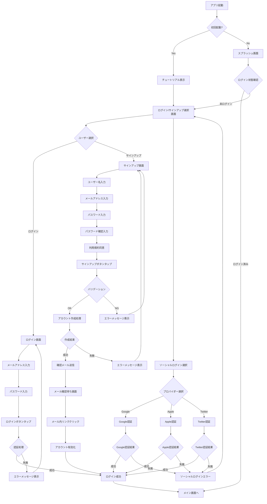
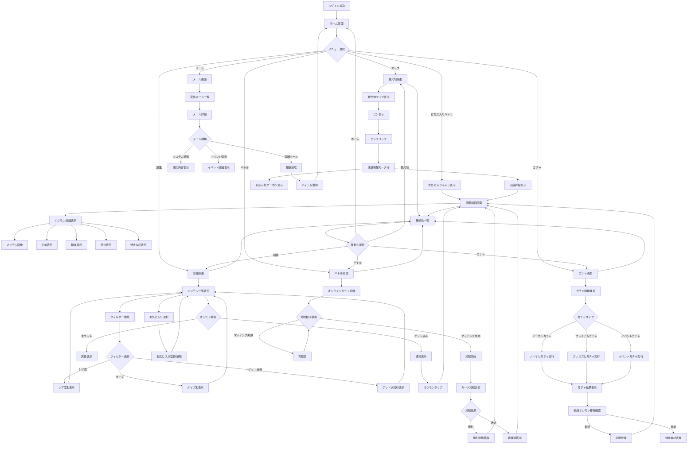
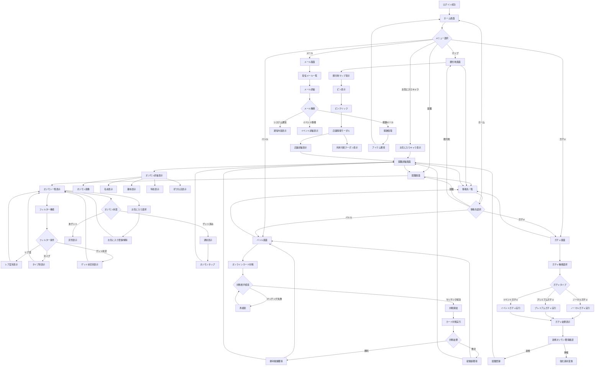
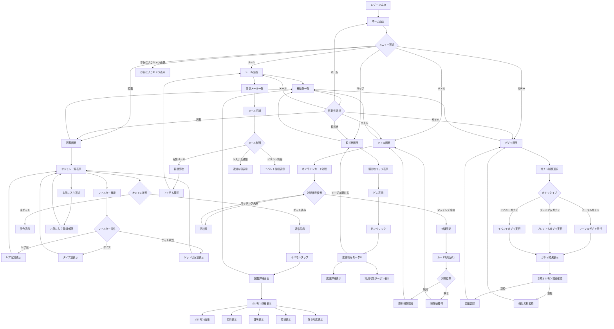

## ログイン・サインイン

## オジモンシステム

## オジモンシステムV2

## オジモンシステムV3

## オジモンシステム　クラス図

[![](https://mermaid.ink/img/pako:eNqtWetu2zYUfhVDwAAXS4pc3FyMroBjK6mG2A5kt1kHAwEjMTZbidJ0yWVFgnXAhg39s18bsBfYQ-zH3qVFf-wtdkhKFilRdlIvRRvxnMND8vA7hx_Zt4YTuNhoG46H4rhH0DRC_oQ24IdLGi9iHDXeCgn7WU9BYLntxiiJCJ2WFBT5WKPCPiKeRu4FU0JHCUrSuN04CAIPIyqpL9BlEJEEd2coQk6CI7A6JnFyN3xN_IDeFaZfck_NRxovTBWkCdNdBsSVFMh1D7MRmgH32G4Iz1XbCPvBJb63-RQnuW3MRq7O-hZ-yXF-Hvh45EQY00q023wTJO8uiUMP3fQxTTXLouiSTFGCx0Efor7EIFyoV9ZQa3WEnBlaaHGAksTDC01OgjfYxdeqTTlIIoJKgMROaAFZA0bio6lOPgvOz2808jjEDkHe6A3xdBjOQTqaBaFGHSFQglub_x7fhFhSJtDMQVRSkXh4niBCsavDNOCrh0Ht8Z0RDjKBZBUXKGySOP-c-1sY6mw_NJAUEWeIrsvG9QviQbZ22WgRQe3GodKuInk4d6lL0zD0boSHplPjstorCaZT7_4JWwBRhHFph3gWXA1EJxLQairWxFN410Q1xh6GEucOlXHrQiVtvmZeFkN4s27Ofp3qOUuAGt1ISoIak0MpEZqrB2wcpBGJfU2ofBT2UAIY6IsPSRUSmp8Rx4HDRzohykGR105UN0ew18WVO-p6xHnThEFgjMK93k8_cJHXhK_QohcBVIbsa_XISEMrcYF5aeugB9ZJ6kLi94L03MPKAUyndbrq1JVwiFhoj77cnmnVvuWl5Fo1FZjwAQXdxTHUhZCFRKOFUz7CcazTXEIOIVh0N0jDYA4c0bqrrbZlP0ydeZgf9YqP8qKFUlmyw0XaRcPeeQ9fNcAcfNLERolub_F1SKKbnlDCv8rBA2xDe-iQ-CXyiKtnWUBUFqNWcABNOp8LxU2cYL-dm_GWnCMJipIh9eBArCUTMUaRMxuGEElMk_-hBMlzUTMNKgiONsvELJNvVeTZEhMe74OiISMgjSKY9TiNaIXv-ShxZifcd6yPPg9PbWDwNXZSONvAdxN4NEeMMO7wlqYHdQtv4svGceolCiVOwGFO7hh_vU80hRslmleE0irLhdqk4b7rEb5CkZvnqs1bdyqygRBg6kCkLZrgqRJJSNVTPhqbainKoBPuijSuuGdG5nwEZqeMUV4yZ8YayE-ZnBG-fB1HuUBzVM11cf3WCgou6OTc_lH2Xdm5h-bB3KOyCDbaQ8q0EzDGWNkTYMgATVaG5ViwunVXXWezdk28CAv-uHxLNCAMMrZdx7-gLg7wle6WugSRbGbCWUHVlaIKbgt9NbXDKHDg_BJTXrxPfT21ZJdvia4zKy0jElY67hNiyu-S4hrPPlcvrsxLZZpaPMVQjVglqCrS89dAmrVYAwxQnYaNMuZ50s--ZEaQJAAP7NpLigyB7UC6MxJOax9DMfbD8rkKRTx60-H9NBGGkBB_YfUph08NtRxI6S5TLcr3uXWXbDIivuoFf_krQfW5orxo9dKnoOdz79l53uevUEOlXXMNrbsC3-ulR2yrOnku0tM_PnXRpzT171JEE77oalElnExZKoniKKuL8BdfNEya-rEy1Xkw2XSfPgWk-TjiqHv2rHDcHfb7w0HRtju2WbRGL05M-0yVHZtH5qDXsV8teudZOu6hJfs87YxNu2ge2Z3RqGiax2Z3bFvdQjIY2v3OcX1xWjr86NVobPbPBsOxdWh1O2NLjoH50hyMz6zB4VCKi3nasXtn_Y51vJBwMmq4cOTTjjW2BkeFwBqcndjDI9uUl3xoDazRc7O3CIZLFzn82lL21oIlSzv_wrbNQfeVtO5vYLctkJk1W6vk1-KhD8Yda5DPX2zZ-Kwq7RwX4WR_AMlffc4P72ljj08knpEwbjQ-_PD3h59_-_TPTx_f_fnplz8aG42P795__PHXf39__-mv96uMxR_WswfNdiN_RYzZAqS34PX1ZxlPVR_kmDznElVN-b1N9_gke1DfWphGemOYUPnBgSmLO_38_s7E4l47ocpNjynUO51yqyrWVxGr1w7l9sDUAr8TKnNsJp-T1UzFET5X5O5kGihHoizPR-mrgWNNIVSsOB7WP-eH9yzO9FUcldCjEgUdWmosKmgp21VRU7aoIKFsUN68sr6_eAYrxptDI8IXOGK3uXgVb1kiczBIDEQSy-yjxGPKvTTqJb3LrGWOzILk1uRX9g6RkZICzKyTsWZMI-Ia7QvkxXjNgCIN9BnaBicvEyOZYR9PjDZ8ukBvJ8aE3kKnENFvg8A32kmUQrcoSKezuZM0dGHE7H8a5yac4nfZi5XR3t_c4D6M9lvj2mivb23tP95-0nqyv9vagb-7m2vGjdFubTxu7e092dzZ3t_Z2dtt7bdu14zv-bCbj_e2dja3W9tbrY3d7d39ze3b_wDf7OZi?type=png)](https://mermaid.live/edit#pako:eNqtWetu2zYUfhVDwAAXS4pc3FyMroBjK6mG2A5kt1kHAwEjMTZbidJ0yWVFgnXAhg39s18bsBfYQ-zH3qVFf-wtdkhKFilRdlIvRRvxnMND8vA7hx_Zt4YTuNhoG46H4rhH0DRC_oQ24IdLGi9iHDXeCgn7WU9BYLntxiiJCJ2WFBT5WKPCPiKeRu4FU0JHCUrSuN04CAIPIyqpL9BlEJEEd2coQk6CI7A6JnFyN3xN_IDeFaZfck_NRxovTBWkCdNdBsSVFMh1D7MRmgH32G4Iz1XbCPvBJb63-RQnuW3MRq7O-hZ-yXF-Hvh45EQY00q023wTJO8uiUMP3fQxTTXLouiSTFGCx0Efor7EIFyoV9ZQa3WEnBlaaHGAksTDC01OgjfYxdeqTTlIIoJKgMROaAFZA0bio6lOPgvOz2808jjEDkHe6A3xdBjOQTqaBaFGHSFQglub_x7fhFhSJtDMQVRSkXh4niBCsavDNOCrh0Ht8Z0RDjKBZBUXKGySOP-c-1sY6mw_NJAUEWeIrsvG9QviQbZ22WgRQe3GodKuInk4d6lL0zD0boSHplPjstorCaZT7_4JWwBRhHFph3gWXA1EJxLQairWxFN410Q1xh6GEucOlXHrQiVtvmZeFkN4s27Ofp3qOUuAGt1ISoIak0MpEZqrB2wcpBGJfU2ofBT2UAIY6IsPSRUSmp8Rx4HDRzohykGR105UN0ew18WVO-p6xHnThEFgjMK93k8_cJHXhK_QohcBVIbsa_XISEMrcYF5aeugB9ZJ6kLi94L03MPKAUyndbrq1JVwiFhoj77cnmnVvuWl5Fo1FZjwAQXdxTHUhZCFRKOFUz7CcazTXEIOIVh0N0jDYA4c0bqrrbZlP0ydeZgf9YqP8qKFUlmyw0XaRcPeeQ9fNcAcfNLERolub_F1SKKbnlDCv8rBA2xDe-iQ-CXyiKtnWUBUFqNWcABNOp8LxU2cYL-dm_GWnCMJipIh9eBArCUTMUaRMxuGEElMk_-hBMlzUTMNKgiONsvELJNvVeTZEhMe74OiISMgjSKY9TiNaIXv-ShxZifcd6yPPg9PbWDwNXZSONvAdxN4NEeMMO7wlqYHdQtv4svGceolCiVOwGFO7hh_vU80hRslmleE0irLhdqk4b7rEb5CkZvnqs1bdyqygRBg6kCkLZrgqRJJSNVTPhqbainKoBPuijSuuGdG5nwEZqeMUV4yZ8YayE-ZnBG-fB1HuUBzVM11cf3WCgou6OTc_lH2Xdm5h-bB3KOyCDbaQ8q0EzDGWNkTYMgATVaG5ViwunVXXWezdk28CAv-uHxLNCAMMrZdx7-gLg7wle6WugSRbGbCWUHVlaIKbgt9NbXDKHDg_BJTXrxPfT21ZJdvia4zKy0jElY67hNiyu-S4hrPPlcvrsxLZZpaPMVQjVglqCrS89dAmrVYAwxQnYaNMuZ50s--ZEaQJAAP7NpLigyB7UC6MxJOax9DMfbD8rkKRTx60-H9NBGGkBB_YfUph08NtRxI6S5TLcr3uXWXbDIivuoFf_krQfW5orxo9dKnoOdz79l53uevUEOlXXMNrbsC3-ulR2yrOnku0tM_PnXRpzT171JEE77oalElnExZKoniKKuL8BdfNEya-rEy1Xkw2XSfPgWk-TjiqHv2rHDcHfb7w0HRtju2WbRGL05M-0yVHZtH5qDXsV8teudZOu6hJfs87YxNu2ge2Z3RqGiax2Z3bFvdQjIY2v3OcX1xWjr86NVobPbPBsOxdWh1O2NLjoH50hyMz6zB4VCKi3nasXtn_Y51vJBwMmq4cOTTjjW2BkeFwBqcndjDI9uUl3xoDazRc7O3CIZLFzn82lL21oIlSzv_wrbNQfeVtO5vYLctkJk1W6vk1-KhD8Yda5DPX2zZ-Kwq7RwX4WR_AMlffc4P72ljj08knpEwbjQ-_PD3h59_-_TPTx_f_fnplz8aG42P795__PHXf39__-mv96uMxR_WswfNdiN_RYzZAqS34PX1ZxlPVR_kmDznElVN-b1N9_gke1DfWphGemOYUPnBgSmLO_38_s7E4l47ocpNjynUO51yqyrWVxGr1w7l9sDUAr8TKnNsJp-T1UzFET5X5O5kGihHoizPR-mrgWNNIVSsOB7WP-eH9yzO9FUcldCjEgUdWmosKmgp21VRU7aoIKFsUN68sr6_eAYrxptDI8IXOGK3uXgVb1kiczBIDEQSy-yjxGPKvTTqJb3LrGWOzILk1uRX9g6RkZICzKyTsWZMI-Ia7QvkxXjNgCIN9BnaBicvEyOZYR9PjDZ8ukBvJ8aE3kKnENFvg8A32kmUQrcoSKezuZM0dGHE7H8a5yac4nfZi5XR3t_c4D6M9lvj2mivb23tP95-0nqyv9vagb-7m2vGjdFubTxu7e092dzZ3t_Z2dtt7bdu14zv-bCbj_e2dja3W9tbrY3d7d39ze3b_wDf7OZi)
